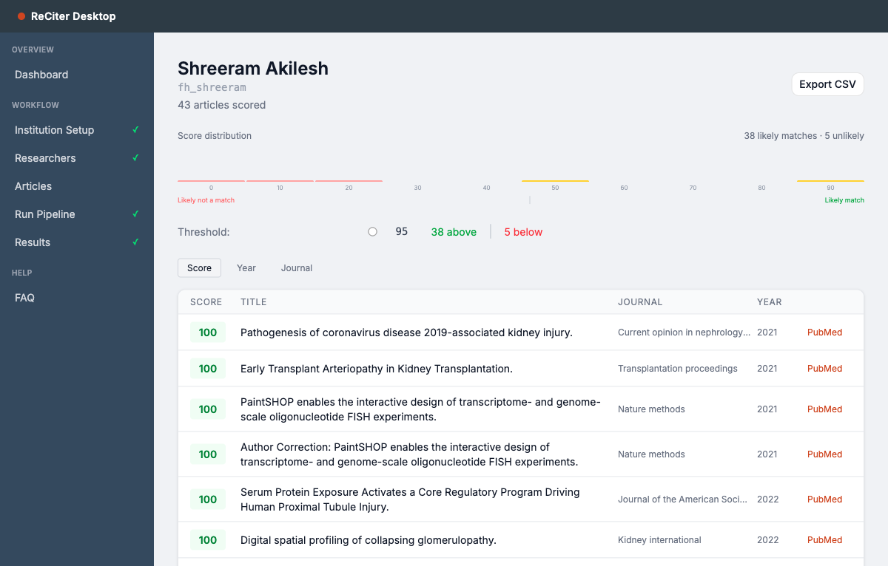
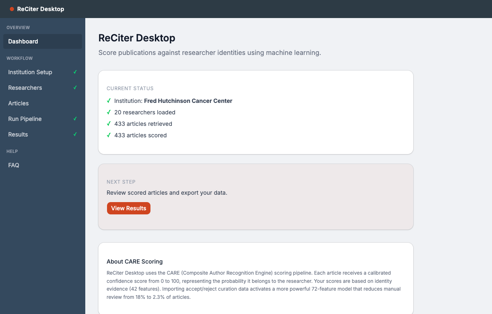
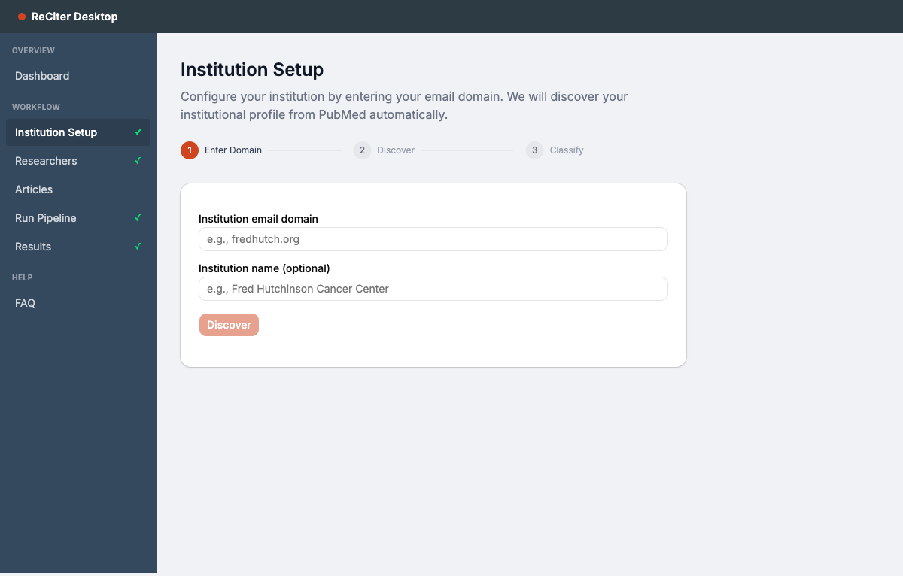
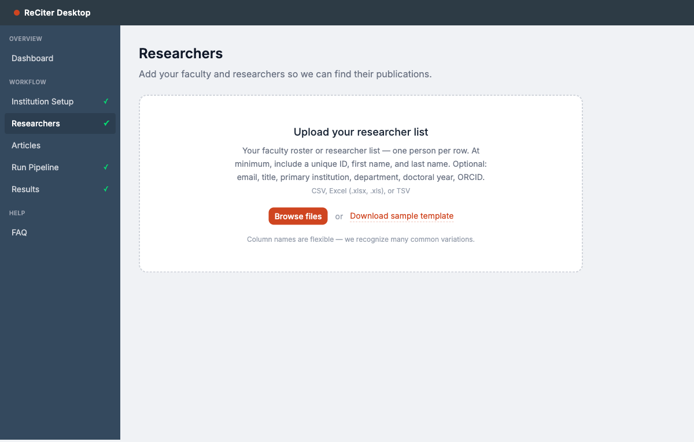
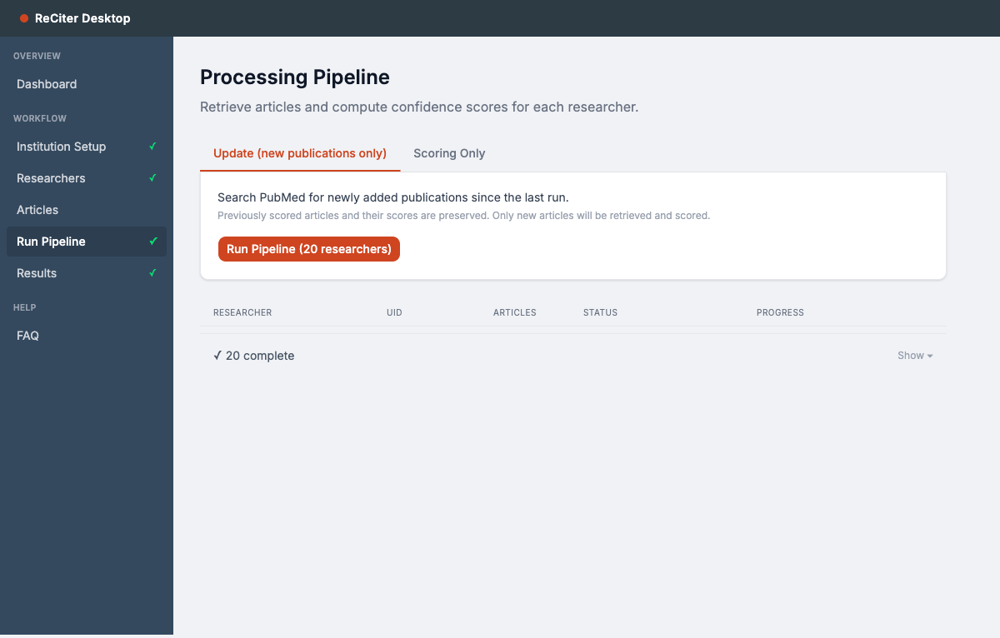
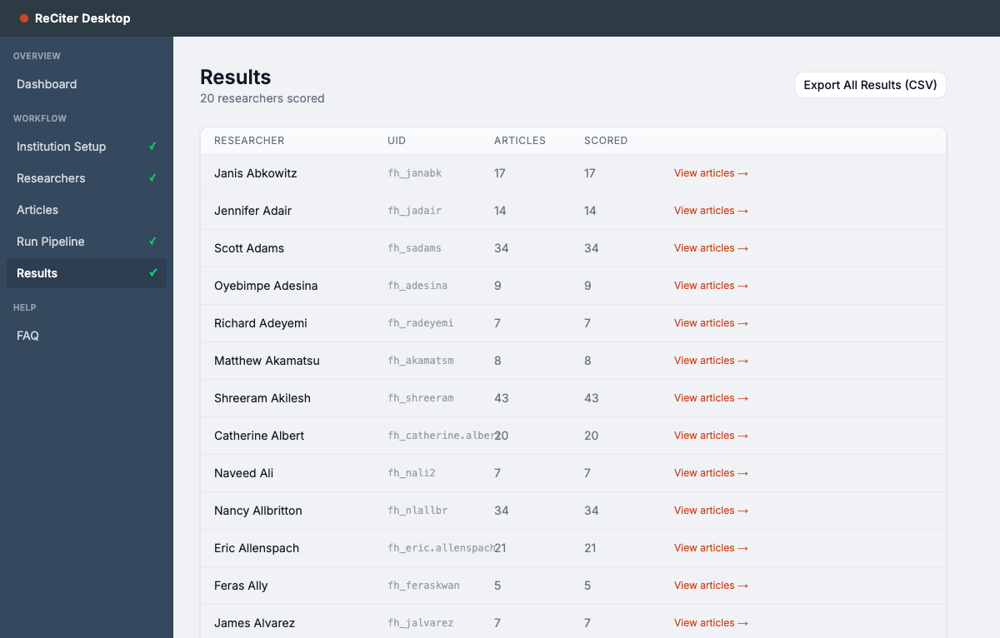

# ReCiter Desktop

Standalone web application for author name disambiguation. Upload a researcher list, retrieve candidate articles from PubMed, and score each article using pre-trained machine learning models — without needing the full ReCiter Java stack.

Designed for librarians and research administrators at academic institutions.



## Quick Start

```bash
# Clone the repository
git clone https://github.com/wcmc-its/ReCiter-Desktop.git
cd ReCiter-Desktop

# Start everything (requires Docker)
docker compose up

# Open the app
open http://localhost:3002
```

Optional: set a PubMed API key for faster retrieval (10 req/sec instead of 3):

```bash
PUBMED_API_KEY=your_key docker compose up
```

## How It Works

ReCiter Desktop uses the CARE (Composite Author Recognition Engine) scoring pipeline to determine whether a PubMed article belongs to a given researcher. For each article-researcher pair, the system:

1. **Retrieves** candidate articles from PubMed by name
2. **Matches** the target author in each article's author list using a 19-step cascade
3. **Analyzes** up to 42 evidence features (72 with curation data): name matching, email, institutional affiliation, journal relevance, degree year, gender inference, derived uncertainty features, and more
4. **Scores** each pair using a pre-trained XGBoost model, calibrated to a 0-100 confidence scale

The pre-trained models are from Weill Cornell Medicine's production ReCiter system, trained on over 900,000 curated article-researcher pairs and validated on 25,091 held-out assertions (AUC 0.9993, 99.99% accuracy at 99% confidence). External validation at Fred Hutchinson Cancer Center (868 researchers) confirmed cross-site generalization without retraining.

## User Workflow

| Step | Page | What happens |
|------|------|-------------|
| 1 | **Institution Setup** | Enter your email domain. The system queries PubMed to discover your institution's affiliated organizations and email domains. You classify each as Home or Collaborating. |
| 2 | **Researchers** | Upload a CSV/Excel file with researcher identities. The system auto-detects column mappings (supports 30+ column name variations). Optionally import accept/reject curation data. |
| 3 | **Articles** | (Optional) Upload known PMIDs for Scoring Only mode. Skip this for Full Retrieval mode where the system discovers articles automatically. |
| 4 | **Pipeline** | Run the scoring pipeline. Choose Full Retrieval and Scoring (discovers new articles) or Scoring Only (scores uploaded PMIDs). Watch per-researcher progress in real time. Subsequent runs only fetch newly added publications. |
| 5 | **Results** | View scored articles per researcher with color-coded confidence scores. Adjust the threshold slider. Export results as CSV. |

## Screenshots

| | |
|---|---|
|  |  |
| **Dashboard** — live status, next step prompt | **Institution Setup** — domain entry, PubMed discovery |
|  |  |
| **Researchers** — upload CSV/Excel with flexible column mapping | **Pipeline** — run scoring, track per-researcher progress |
|  |  |
| **Results** — all researchers with article counts | **Article Scores** — histogram, threshold slider, per-article confidence |

## Operating Modes

**Full Retrieval and Scoring** — The system searches PubMed for each researcher by name, discovers candidate articles, then scores them. Use this when you want to find publications you may not already know about.

**Scoring Only** — Upload a CSV of known PMIDs (person_id + pmid). The system fetches article metadata and scores them. No broad PubMed search. Use this when you already have complete publication lists.

**Incremental Updates** — When re-running the pipeline for previously scored researchers, only newly added publications are retrieved. Previously scored articles and their scores are preserved.

## Validation

The pre-trained models were developed at Weill Cornell Medicine and externally validated at Fred Hutchinson Cancer Center without retraining.

**Fred Hutchinson Cancer Center validation (868 researchers, ~20,000 publications)**

| Metric | Identity-only model | Feedback model |
|--------|--------------------|----|
| Features | 42 | 72 |
| AUC | 0.9776 | 0.9993 |
| Accuracy at 95% confidence | 99.57% | 99.99% |
| Articles requiring manual review | 18% | 2.3% |

The feedback model activates automatically when you import accept/reject curation data (as an `assertion` column in your PMID upload). Feedback features account for 84.8% of model importance — importing even partial curation data dramatically improves precision.

Score thresholds:
- **≥ 95** — Likely match (green). High confidence, minimal manual review required.
- **30–94** — Review band (yellow). Examine before accepting.
- **< 30** — Likely not a match (red).

## Architecture

Three-container Docker Compose application:

```
docker compose up
  ├── frontend   (Next.js 14, port 3002)
  ├── api        (Python FastAPI, port 8090)
  └── db         (MariaDB 11, port 3306)
```

- **Frontend**: Next.js 14 App Router, Tailwind CSS, shadcn/ui
- **Backend**: FastAPI wrapping the existing Python scoring engine (`core/`, `features/`)
- **Database**: MariaDB 11 (chosen for future compatibility with [ReCiter Publication Manager](https://github.com/wcmc-its/reciter-publication-manager))
- **ML**: XGBoost 3.2.0 with isotonic calibration

The scoring engine (`core/` and `features/` directories) is the same code used in production at Weill Cornell Medicine. The FastAPI backend wraps it as a REST API. Long-running operations (institution discovery, article retrieval, pipeline processing) stream progress via Server-Sent Events.

## Researcher File Format

CSV, Excel (.xlsx, .xls), or TSV with one row per researcher.

**Required columns** (names are flexible):

| Field | Example column names |
|-------|---------------------|
| Person ID | `person_id`, `uid`, `emp_id`, `cwid`, `netid` |
| First Name | `first_name`, `fname`, `first`, `givenname` |
| Last Name | `last_name`, `lname`, `last`, `surname` |

**Optional columns**:

| Field | Example column names |
|-------|---------------------|
| Middle Name | `middle_name`, `middle`, `mi` |
| Email | `email`, `primary_email`, `email_address` |
| Title | `title`, `rank`, `academic_title`, `position` |
| Primary Institution | `institution`, `primary_institution` |
| Department | `department`, `dept`, `division` |
| Doctoral Year | `doctoral_year`, `phd_year`, `degree_year` |
| ORCID | `orcid`, `orcid_id`, `orcid_url` |

**Gold standard columns** (for importing curation data):

| Field | Example column names |
|-------|---------------------|
| PMID | `pmid`, `pubmed_id` |
| Assertion | `assertion`, `status`, `user_assertion` |

When curation data is present, the system uses a more powerful 43-feature scoring model instead of the 25-feature identity-only model.

## Scoring Models

| Model | Features | When Used |
|-------|----------|-----------|
| Identity Only | 42 (18 base + 24 engineered) | No curation data available |
| Feedback + Identity | 72 (18 base + 15 feedback + 5 uncertainty + 24 engineered + 8 feedback-derived + 2 counts) | Curation data imported |

The **identity-only model** uses 8 identity features (name, email, gender, degree year), 4 institutional features (affiliation, department, grants), 3 bibliometric features (journal, author/article count), 3 relationship features, and 24 engineered features (name frequency, ambiguity risk, interaction terms). AUC 0.9776, 99.57% accuracy at 95% confidence.

The **feedback model** adds 15 feedback synthesis features (sigmoid-based aggregation of prior curation decisions across co-authors, journals, keywords, institutions, etc.), 5 derived uncertainty features (Wilson lower bound acceptance rate, feedback confidence), and 8 feedback-specific derived features. AUC 0.9993, 99.99% accuracy at 99% confidence. Feedback features account for 84.8% of model importance.

Curation reduces manual review burden from 18% to 2.3% of articles (87% reduction).

Both models use isotonic regression calibration — scores are true probabilities. A score of 95 means 95% of articles at that level are correctly attributed.

## API Reference

| Method | Endpoint | Purpose |
|--------|----------|---------|
| GET | `/api/health` | Health check |
| POST | `/api/institution/discover` | Auto-discover institution from PubMed (SSE) |
| POST | `/api/institution/configure` | Save institution configuration |
| GET | `/api/institution` | Get current configuration |
| POST | `/api/researchers/upload` | Upload CSV, get column mappings |
| POST | `/api/researchers/import` | Import with confirmed mappings |
| GET | `/api/researchers` | List all researchers |
| GET | `/api/researchers/{id}` | Get researcher detail |
| POST | `/api/articles/upload` | Upload PMID CSV |
| GET | `/api/articles/{id}` | Get articles for researcher |
| POST | `/api/pipeline/run` | Run scoring pipeline (SSE) |
| GET | `/api/pipeline/status` | Get pipeline status |
| GET | `/api/scores/{id}` | Get scores for researcher |
| GET | `/api/scores/export` | Export scores as CSV |

## Project Structure

```
ReCiter-Desktop/
├── frontend/                    # Next.js 14 app
│   ├── app/                    # Pages (dashboard, setup, researchers, etc.)
│   ├── components/             # UI components (sidebar, cards, upload, etc.)
│   └── lib/                    # API client, SSE helper
├── api/                         # FastAPI backend
│   ├── routers/                # API endpoints
│   ├── services/               # Business logic (discovery, column mapper, pipeline)
│   └── models.py               # SQLAlchemy ORM models
├── core/                        # Scoring engine (unchanged from production)
│   ├── scoring.py              # XGBoost + isotonic calibration
│   ├── feature_generator.py    # Feature computation pipeline
│   ├── target_author.py        # 19-step author matching cascade
│   └── pubmed.py               # PubMed E-utilities client
├── features/                    # Individual feature calculators
├── models/wcm/                  # Pre-trained WCM production models
├── data/                        # Lookup tables (name frequency, gender, journals)
├── config/default_config.yaml   # Scoring weights
└── docker-compose.yml          # One command to start everything
```

## Development

Run components individually for development:

```bash
# Database
docker compose up db

# Backend (with hot reload)
cd api
pip install -r requirements.txt
PYTHONPATH=.. uvicorn api.main:app --reload --port 8090

# Frontend (with hot reload)
cd frontend
npm install
npm run dev
```

## Requirements

- Docker and Docker Compose (for production use)
- Python 3.12+ (for development)
- Node.js 20+ (for development)
- XGBoost 3.2.0 (pinned — cross-version model loading causes score drift)

## Future Roadmap

- **Curation workflow** — Accept/reject articles in the UI via [Publication Manager](https://github.com/wcmc-its/reciter-publication-manager) integration
- **Local model training** — Train on your institution's curation data
- **Scopus integration** — Additional article retrieval source

## Related Projects

- [ReCiter](https://github.com/wcmc-its/reciter) — Full Java-based author disambiguation engine
- [ReCiter Publication Manager](https://github.com/wcmc-its/reciter-publication-manager) — Web UI for article curation
- [ReCiter Identity Model](https://github.com/wcmc-its/reciter-identity-model) — Identity data model

## License

Apache 2.0
